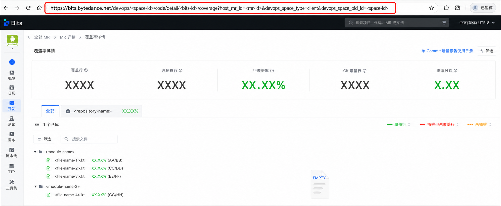

# Codecov 命令详解

## report create

最小输入 `--psm` + `--branch`：CLI 自动串 project_id / commit / author 再调用 `POST /api/v2/full/report/create`。

必填：`--psm`, `--branch`
常用可选：`--os-type server`（默认）, `--base-commit <7~64位>`, `--author-id`, `--tag`, `--env`, `--commit-list`

```bash
bytedcli codecov report create --psm example.service.api --branch master
bytedcli codecov report create --psm example.service.api --branch feat/x --os-type server --base-commit 0000000aaaa
```

## report create-incr

最小输入 `--psm` + `--branch`：CLI 直接调用增量报告创建接口。

必填：`--psm`, `--branch`
常用可选：`--os-type server`（默认，仅支持 `server/server-cpp/server-java/server-nodejs/python`）, `--author-id`, `--if-send-robot`, `--region cn|i18n`（默认 `cn`）

```bash
bytedcli codecov report create-incr --psm example.service.api --branch feat/demo
bytedcli codecov report create-incr --psm example.service.api --branch feat/demo --os-type server-java --if-send-robot
```

## report incr get

读取已存在的服务端 MR 增量报告。可以传 `--report-id`；没有 report ID 时必须传精确的 `--psm` + `--branch`，建议同时传 `--commit` 和 `--mr-id` 精确选择当前子报告。

```bash
bytedcli codecov report incr get \
  --psm example.service.api \
  --branch feat/demo \
  --commit 0000000aaaa \
  --mr-id TE-XXX-demo \
  --region i18n

bytedcli -j codecov report incr get \
  --report-id 10000001 \
  --psm example.service.api \
  --commit 0000000aaaa \
  --region i18n
```

该命令只调用增量能力：`GET /api/v2/increase/server/search`、`GET /api/v2/increase/get_sub_reports` 和 `GET /api/v2/increase/get_change_files_data`。它不会调用 `/api/v2/full/report/batch_search` 或 `/api/v2/full/report/update_report`，也不依赖 BITS task output。

主/子报告解析成功后，返回 `availability=available`、`report_state=current`，以及 report/project/MR/commit 标识、`covered_lines`、`instrumented_lines`、百分比数值 `coverage_percent` 和 `report_url`。其中 `project_id` 是 increase 响应的 `AppId`（对外项目 ID），`coverage_project_id` 是 increase 响应的 `ProjectID`（文件明细接口使用的内部 coverage repository ID）。文件明细查询失败时，汇总仍然有效，仅返回 `file_detail.status=blocked` 和原因。

当前 increase API 只暴露报告的当前状态，没有已验证的不可变历史快照接口。同一 report ID 后续生成了新 commit 时，旧 commit 的精确查询不会伪造历史结果：CLI 返回 `CODECOV_INCR_SNAPSHOT_MISMATCH`，并在 details 中列出当前子报告标识。没有 report ID 的有界搜索若仍有后续页，会返回 `CODECOV_INCR_SEARCH_TRUNCATED`，不会把截断误报为 not found。

## report incr rerun

重新触发已经存在的服务端增量报告生成。selector 二选一且互斥：`--report-id`，或精确的 `--psm` + `--branch`；两种模式都可以再用 `--commit`、`--mr-id` 限定当前报告。`--region` 控制 Codecov coverage 数据区域，独立于全局 `--site`，因此 `--site boe` 不会自动切到 `i18n`。

```bash
bytedcli --json --site boe codecov report incr rerun \
  --report-id 10000001 \
  --region i18n

bytedcli --json --site boe codecov report incr rerun \
  --psm example.service.api \
  --branch feat/demo \
  --region i18n
```

命令先复用 `report incr get` 的 current-state 解析，自动取得 `AppId`、`ProjectID`、`os_type`、`mr_id` 和 `tag`，再调用该 `--region` 对应的 `POST /api/v2/increase/data/mrproduce`。wire 字段映射固定为：

| mrproduce 字段 | 来源                                                                                  |
| -------------- | ------------------------------------------------------------------------------------- |
| `app_id`       | `report incr get` 的 `project_id`，即 increase `AppId`；wire 类型为 string            |
| `project_id`   | `report incr get` 的 `coverage_project_id`，即 increase `ProjectID`；wire 类型为 string |
| `os_type`      | 已解析报告的 `os_type`                                                                |
| `mr_id`        | 已解析报告的 `mr_id`                                                                  |
| `user`         | 当前登录用户；可用 `--user-name` 覆盖                                                 |
| `tag`          | 已解析报告的 `tag`                                                                    |

默认触发成功后轮询同一个 incremental report，直到 `update_time` 晚于刷新前。覆盖行数可以不变；只要 `update_time` 前进就判定完成。`--no-wait` 立即返回 `refresh_status=accepted`；`--wait-timeout-sec` 默认 `30`，超时返回 `refresh_status=timeout` 和最后一次观测值，不会把旧的覆盖率包装成已完成结果。

标准 JSON envelope 的 `data` 至少包含：

```json
{
  "refresh_status": "completed",
  "report_id": 10000001,
  "psm": "example.service.api",
  "branch": "feat/demo",
  "mr_id": "TE-XXX-demo",
  "region": "i18n",
  "previous_update_time": "2026-08-01T11:00:00Z",
  "current_update_time": "2026-08-01T11:01:00Z",
  "previous_covered_lines": 0,
  "current_covered_lines": 57,
  "previous_instrumented_lines": 73,
  "current_instrumented_lines": 73,
  "current_coverage_percent": 78.08
}
```

该命令不查询 `access-status`，已有报告即使 access status 为空或 false 也可以刷新；它不会调用任何 `/api/v2/full/report/*` 接口。`report create-incr` 的 `/api/v2/increase/server/branch_diff` 仍只用于创建增量报告，未证明与 `mrproduce` 语义等价，不作为刷新 fallback。

## report update

全量报告命令。互斥：`--rid` 或 `--psm` + `--branch`。默认轮询等待 30s；`--no-wait` 立即返回；`--wait-timeout-sec` 调节。

```bash
bytedcli codecov report update --rid 10000001
bytedcli codecov report update --psm example.service.api --branch master --wait-timeout-sec 60
bytedcli codecov report update --rid 10000001 --no-wait
```

## report get

全量报告命令。同样支持 `--rid` 或 `--psm` + `--branch`；后者会打印 `Resolved rid: …` 再调用 get。

```bash
bytedcli codecov report get --rid 10000001
bytedcli codecov report get --psm example.service.api --branch master
```

## report list

按 PSM 列全量历史报告；默认过滤 `line_covered_ratio > 0 && method_covered_ratio > 0`。

```bash
bytedcli codecov report list --psm example.service.api --branch master --limit 5
bytedcli codecov report list --psm example.service.api --no-only-valid
```

## report incr list-files

读取 coverage-next 增量文件树，对应页面请求 `GET /api/v2/increase/get_change_files_data`。常用于先定位哪个文件仍缺覆盖、哪些文件已经被标记。

必填：`--coverage-project-id`, `--mr-id`。`--coverage-project-id` 取自 `report incr get` 的同名输出字段，不是对外 `project_id`。已发布的 `--project-id` 保留为隐藏兼容别名，新调用统一使用 `--coverage-project-id`。
常用可选：`--os-type server`（默认）, `--psm <psm>`（子报告 PSM；传入后会带 `is_sub_report=true`）, `--tag`, `--project-tags`, `--region cn|i18n`（默认 `cn`）

```bash
bytedcli codecov report incr list-files --coverage-project-id 100001 --mr-id TE-XXX-demo --psm example.service.api
bytedcli -j codecov report incr list-files --coverage-project-id 100001 --mr-id TE-XXX-demo --psm example.service.api
```

## report incr update

批量标记 coverage-next 增量文件，对应页面请求 `POST /api/v2/comment/increase/report/comment_create`。这不是 BITS gatekeeper skip；它只执行 coverage-next 页面上的“无需测试覆盖 / 无法测试覆盖”等文件归因操作。

必填：`--coverage-project-id`, `--mr-id`, `--file`
常用可选：`--os-type server`（默认）, `--psm <psm>`, `--comment-tag <tag>`, `--reset`, `--user-name`, `--dry-run`

`--file` 支持重复传入，也支持逗号分隔。建议先加 `--dry-run` 查看即将提交的 payload，再去掉 `--dry-run` 真正提交。

```bash
bytedcli codecov report incr update \
  --coverage-project-id 100001 \
  --mr-id TE-XXX-demo \
  --psm example.service.api \
  --file service/activity/demo.go \
  --comment-tag no-coverage-required \
  --dry-run

bytedcli codecov report incr update \
  --coverage-project-id 100001 \
  --mr-id TE-XXX-demo \
  --psm example.service.api \
  --file service/activity/demo.go \
  --comment-tag no-coverage-required
```

可用 `--comment-tag`：

| tag                    | coverage-next 含义 |
| ---------------------- | ------------------ |
| `no-coverage-required` | 无需测试覆盖       |
| `untestable`           | 无法测试覆盖       |
| `useless-code`         | 无用代码           |
| `uninstrumentable`     | 无法插桩           |
| `miss-test`            | 补充 case          |
| `add-case`             | 添加 case          |
| `private-code`         | 私有代码           |

需要取消已有标记时传 `--reset`，此时不需要 `--comment-tag`，CLI 会发送 `operation_type=2`。

注意：`report incr update` 仍然只做 coverage-next 文件归因标记，不触发增量报告重新生成；重新触发生成使用 `report incr rerun`。

## report client get

从标准客户端 BITS MR 覆盖率 URL 读取文件树和逐文件源码，生成结构化 JSON、固定章节的 Markdown 报告以及可通过 API 消费的逐行 action manifest。URL 路径应为 `/devops/<space>/code/detail/<bits-id>/coverage`，并包含 `devops_space_type=client`。

报告只把以下行纳入待处理集合：本次 MR 变更行、有效覆盖统计行、未覆盖、可评论、尚无 BITS tag / `is_mark` / `comment_id`。已覆盖行不会进入行级明细；单个文件拉取失败时，其余文件仍会生成报告，并在 `failures` 与 Markdown 的“拉取失败”章节中列出。

### 应该复制哪个链接

打开客户端 BITS MR 的“覆盖率详情”页面，复制浏览器地址栏中的**完整 URL**，原样传给 `--url`。不要粘贴 Codebase MR 链接、BITS MR 详情链接或页面请求的接口地址。地址必须包含 `/devops/<space>/code/detail/<bits-id>/coverage` 路径以及 `devops_space_type=client` 查询参数；其余查询参数可以保留。

CLI 解析后只会在报告和 action manifest 的 `source_url` 中保留覆盖率所需的已知查询参数，不会把 `ticket`、`token`、`code`、`state` 等临时认证参数写入产物。



```bash
BITS_COVERAGE_URL='<client-bits-coverage-url>'
bytedcli codecov report client get \
  --url "$BITS_COVERAGE_URL" \
  --report-output ./coverage-report.md \
  --actions-output ./coverage-actions.json

bytedcli -j codecov report client get --url "$BITS_COVERAGE_URL"
```

常用可选参数：

| 参数                      | 说明                                        |
| ------------------------- | ------------------------------------------- |
| `--coverage-type <type>`  | 覆盖率类型，默认使用 URL 中的值，否则为 `0` |
| `--concurrency <n>`       | 逐文件源码请求并发，范围 `1..16`，默认 `4`  |
| `--report-output <path>`  | 把 Markdown 报告写入文件                    |
| `--actions-output <path>` | 把 JSON action manifest 写入文件            |

生成的 action 默认没有业务标签，并带 `needs_explicit_label_confirmation=true`。CLI 只能确认“有效变更行未覆盖”，不会在缺少 MR diff、技术方案、PRD、QA Case 或 Meego 证据时自动断言漏测/无法测试/插桩异常/冗余代码。

## report client execute

读取 `report client get` 生成的 manifest。无 `comment_id` 时调用 `comment_create`，并按项目、MR、平台、`file_path`、完整行号集合和 `comment_tag` 去重；有 `comment_id` 时调用 `comment_add`，按项目、MR、平台、`file_path` 和已有 `comment_id` 区分动作，同一评论的标签或完整行号集合冲突时会在任何写入前拒绝执行。默认仅返回执行预览，并逐项展示动作、项目、MR、平台、文件、完整行号集合和标签，不调用写接口；只有显式 `--yes` 才提交。

```bash
# 预览：不调用写接口
bytedcli codecov report client execute \
  --actions-file ./coverage-actions.json \
  --comment-tag miss-test

# 仅在人工明确确认标签和范围后提交
bytedcli codecov report client execute \
  --actions-file ./coverage-actions.json \
  --comment-tag miss-test \
  --yes

# 撤销已有标记：action 保留 comment_id、完整 comment_lines，并将 comment_tag 设为 null
bytedcli codecov report client execute \
  --actions-file ./coverage-reset-actions.json \
  --comment-tag reset
bytedcli codecov report client execute \
  --actions-file ./coverage-reset-actions.json \
  --comment-tag reset \
  --yes
```

`--comment-tag` 推荐使用语义值 `miss-test`、`untestable`、`uninstrumentable`、`useless-code`、`reset`。manifest 已逐项提供 `payload.comment_tag` 时保留逐项标签；`--comment-tag` 只补充 `comment_tag=null` 的未分类 action，不会覆盖已有标签。真正提交遇到首个 API、权限或参数失败时立即停止，错误详情包含 `succeeded`、`failed`、`unexecuted`，便于修正后消费剩余 action。

BITS 客户端撤销标记不是删除评论，而是复用 `comment_add`，保留已有 `comment_id` 和原标记覆盖的完整 `comment_lines`，把 manifest/wire 字段 `comment_tag` 更新为 `0`。使用语义参数 `--comment-tag reset` 时，应把 action 的 `comment_tag` 保持为 `null`；若 manifest 已直接写入 `0`，则省略该参数。撤销 action 必须包含已有 `comment_id`；对没有 `comment_id` 的 `comment_create` 使用 `reset` 会被 CLI 拒绝。`report client get` 默认过滤已有标记，因此不会自动生成撤销 action；需要从已有标记数据中保留这些字段并构造如下 manifest 条目：

```json
{
  "key": "demo-reset-action",
  "action": "comment_add",
  "endpoint": "https://example.invalid/comment_add",
  "execute_on_confirm": true,
  "needs_explicit_label_confirmation": false,
  "payload": {
    "os_type": "Android",
    "mr_id": "demo-mr",
    "user_name": "demo-user",
    "project_id": "demo-project",
    "file_path": "app/Demo.kt",
    "comment_tag": 0,
    "comment_lines": [23, 24],
    "comment_id": 100001
  }
}
```

manifest 中 `execute_on_confirm=false` 的 action 不会进入预览或提交集合；可用它显式排除不希望执行的行。

## report link

纯 URL 拼接，无 HTTP；脚本可直接消费。

```bash
bytedcli codecov report link --rid 10000001
# -> https://bits.bytedance.net/quality/measure/coverage-next/full?language=1&rId=10000001&region=cn&viewId=1
```

## access-status

查询单个 PSM 是否接入覆盖率平台。命令对外暴露 4 种稳定状态字符串：

| CLI status       | 含义                                                                              |
| ---------------- | --------------------------------------------------------------------------------- |
| `accessed`       | 已接入采集（后端 access_status=1）                                                |
| `not_accessed`   | 已在平台登记但未接入（后端 access_status=2，access_message 区分子状态）           |
| `inactive`       | 服务不活跃（后端 access_status=3）                                                |
| `not_registered` | 未在覆盖率平台登记任何服务实例（**推断状态**——也可能是 ACL 过滤或后端短暂空响应） |

注意 `not_registered` 是**推断状态**：CLI 在后端返回空 `services` 时合成此状态，但同样的形态也可能是 (a) 调用方对该 PSM 无权限、(b) 后端短暂空响应，或 (c) PSM 拼写错误。它只能作为辅助诊断，不能作为 `report incr get` 的硬门禁；若增量接口已经返回成功报告，应以报告为准。

`not_registered` 与 `not_accessed` 的区别：前者后端没有任何 PSM 记录（推断），后者已登记但尚未接入采集（权威）。

```bash
bytedcli codecov access-status --psm example.service.api
bytedcli -j codecov access-status --psm example.service.api
```

JSON 输出（`-j`）：

```json
{
  "psm": "example.service.api",
  "registered": true,
  "services": [
    {
      "psm": "example.service.api",
      "status": "not_accessed",
      "access_status_code": 2,
      "os_type": "server",
      "language": 1,
      "access_message": "not register"
    }
  ]
}
```

`not_registered` 情况下 `registered: false`，`services: []`。

## create-report (deprecated)

保留兼容老脚本，内部转发到 `codecov report create`。返回的 `bytest_url` 字段现在承载 bits coverage-next 链接，不再是旧 bytest 页面。参数 `--base-commit` 放宽到 7~64 位。

## create-tag / delete-tag / set-interval

采集侧命令，走 `srvcov.byted.org`，未做改动。

## region / site / env 边界

- bytedcli 全局 `--site` 控制通用网关和鉴权，默认逻辑不变
- 增量命令 `--region` 控制 Codecov 数据面，只支持 `cn` 与 `i18n`，默认 `cn`
- BOE lane/env 是业务流量环境；查询覆盖率不应为此发送 BOE/PPE 业务请求
- 报告字段 `coverage_env` 是覆盖率报告自身环境，不由 `--site` 或 `--region` 代替
