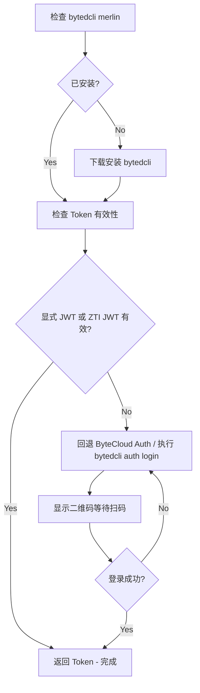

# bytedcli Merlin

## 摘要

bytedcli Merlin 是一个命令行工具，用于调用 Merlin MCP Server 提供的各种 API。工具按领域自动分组（job, cpu-devbox, eval, insight, ...），使用 schema-derived CLI options；object/array 字段传 JSON-valued option。

**兜底角色**：本 skill 是 Merlin 相关 skills 的兜底。若用户需求未命中 merlin-job-launch、merlin-devbox、merlin-eval-query、merlin-insight 等更具体的 skill，或用户明确问「bytedcli merlin 有什么命令」「怎么用命令行做 X」，应优先通过本 skill 查找并执行 bytedcli merlin（`merlin --help`、`merlin <group> --help`、`--schema`、schema-derived options）。

## 适用场景

- 用户问「bytedcli merlin 有哪些命令」「怎么用 bytedcli merlin 做 X」且无其它 skill 覆盖
- 当 MCP 工具不可用时，作为替代方案
- 调试和测试 MCP 工具
- 批量操作
- Agent 自动化调用（需要结构化输出时加全局 `--json`，业务入参仍用 schema-derived options）

## 安装

```bash
NPM_CONFIG_REGISTRY=http://bnpm.byted.org npx -y @bytedance-dev/bytedcli@latest merlin --help
```

## Agent 推荐工作流

1. **发现工具**：`bytedcli merlin --help` 或 `bytedcli merlin <group> --help`
2. **查看 Schema**：`bytedcli merlin <group> <command> --schema`
3. **预览请求**：`bytedcli merlin <group> <command> --dry-run [schema-derived options]`
4. **执行调用**：`bytedcli merlin <group> <command> [schema-derived options]`

## 使用方法

### option-first 调用（推荐）

```bash
# 查看参数 Schema
bytedcli merlin job get-run --schema

# schema 字段转为 kebab-case option
bytedcli merlin job get-run --job-run-id xxx

# 从文件读取参数
bytedcli merlin job fork-run --schema  # then pass schema-derived options

# 预览请求（不执行）
bytedcli merlin job get-run --job-run-id xxx --dry-run
```

### 分组命令

```bash
# 查看分组帮助
bytedcli merlin job --help
bytedcli merlin cpu-devbox --help                # GPU 开发机用 bytedcli merlin gpu-devbox --help
bytedcli merlin training companion-jobs --help   # v4 伴生评估在 training 分组；顶层 eval 分组已改为 Seed PE 模板

# 分组调用示例
bytedcli merlin cpu-devbox instances list
bytedcli merlin insight get --sid xxx
bytedcli merlin arena get-evaluation --sid xxx
bytedcli merlin tracking run entity-names --project-name demo-project --run-id demo-run
```

### 工具发现

```bash
# 列出所有可用的工具（按分组显示）
bytedcli merlin --help

# 查看某个分组下的命令
bytedcli merlin job --help

# 查看特定工具的帮助和可用参数
bytedcli merlin job get-run --help
```

## 工具分组

| 分组         | 说明                                                                         | 示例命令                                                                                                                                                               |
| ------------ | ---------------------------------------------------------------------------- | ---------------------------------------------------------------------------------------------------------------------------------------------------------------------- |
| `job`        | 训练任务管理                                                                 | `job get-run`, `job list-run`, `job create-run`, `job fork-run`, `job retry-run`                                                                                       |
| `pipeline`   | Pipeline 管理                                                                | `pipeline get-def`, `pipeline list-run`, `pipeline retry-run`                                                                                                          |
| `trigger`    | Trigger 管理                                                                 | `trigger get-def`, `trigger list-run`, `trigger update-def`                                                                                                            |
| `cpu-devbox` | CPU 开发机管理（GPU 走 `gpu-devbox`）                                        | `cpu-devbox instances list`, `cpu-devbox instances get`, `cpu-devbox instances start`                                                                                  |
| `tracking`   | 实验跟踪与指标                                                               | `tracking runs list`, `tracking run-entities list`, `tracking get-timeseries`                                                                                          |
| `exercise`   | 评估 Exercise 管理                                                           | `exercise get`, `exercise get-version`, `exercise list`                                                                                                                |
| `collection` | 评估 Collection 管理                                                         | `collection get`, `collection get-version`                                                                                                                             |
| `eval`       | Seed PE 模板（v4 顶层 eval 已改为 Seed PE 模板；伴生评估见 `training` 分组） | `eval --help`                                                                                                                                                          |
| `arena`      | Arena 评估                                                                   | `arena get-evaluation`, `arena list-case`                                                                                                                              |
| `insight`    | Insight 分析与用例搜索                                                       | `insight get`, `insight create`, `insight search-case`, `insight update`                                                                                               |
| `training`   | Checkpoint / 训练产物与伴生评估管理                                          | `training checkpoint-dirs get`, `training checkpoint-dirs list`, `training companion-jobs list`, `training companion-jobs create`, `training companion-configs update` |
| `data`       | 数据卡片管理                                                                 | `data list`, `data get-detail`, `data get-data-preview`, `data list-tags`, `data list-columns`                                                                         |
| `model`      | 模型卡片管理                                                                 | `model get`, `model get-v2`, `model create-v2`, `model list-history`, `model get-lineage-asset`                                                                        |
| `resource`   | 资源配额/集群/租户查询                                                       | `resource list-my-resource`, `resource clusters list`                                                                                                                  |
| `knowledge`  | 知识库搜索                                                                   | `knowledge search`                                                                                                                                                     |
| `service`    | 推理服务                                                                     | `service get`, `service list-seed-templates`, `service list-instant-deployments`                                                                                       |

## 认证

先检查所选站点的认证状态：

```bash
bytedcli --site <site> auth status
```

在生产网环境（`BYTEDCLI_NETWORK_PROFILE=prod`）中，若存在 `SEC_TOKEN_STRING` 或 `SEC_TOKEN_PATH`，Merlin 会自动按站点执行 ZTI→个人 ByteCloud JWT，支持 `cn`、`i18n`、`i18n-tt`、`i18n-bd`，通常不需要扫码登录。`auth status` 的 `zti_jwt` 段会显示 `available`、`ready` 或安全的失败码。显式 JWT override 优先；ZTI 不可用或交换失败时自动回退 ByteCloud Auth。

如果没有可用 ZTI，或回退后的请求仍出现认证错误（401/403），再运行：

```bash
bytedcli auth login
```

### 海外员工（TT）登录

`bytedcli auth login` 默认走 OAuth2 Device Code 登录流程，无需额外 flag。海外员工只需通过全局 `--site` 选择对应控制面（TikTok 用 `i18n-tt`，ByteIntl 用 `i18n-bd`）：

```bash
# TikTok i18n 控制面登录
bytedcli --site i18n-tt auth login

# ByteIntl 控制面登录
bytedcli --site i18n-bd auth login
```

登录时 CLI 会显示一个浏览器验证链接和用户码，在浏览器中打开链接并使用账号密码或 passkey 完成认证即可。

## 注意事项

- 推荐使用 `--json` 传参，尤其是 Agent 调用场景
- 使用 `--schema` 查看工具的参数 JSON Schema
- 使用 `--dry-run` 预览请求不执行
- 复杂参数（对象、数组）使用 JSON 格式传递

## API 认证与 JWT

处理 Merlin MCP API 的认证问题：生产网优先使用 ZTI 换取个人 JWT，其余环境或失败场景回退到 ByteCloud Auth 登录获取个人 JWT。

## 触发条件

当出现以下情况时激活本 bytedcli merlin skill：

- 调用 Merlin MCP 接口返回 401 Unauthorized
- 调用 Merlin MCP 接口返回 403 Forbidden
- JWT Token 过期或无效
- 需要重新登录

## 控制面 (Control Plane)

Merlin 有多个控制面，对应不同用户群和域名：

| 控制面    | 标识      | 域名                     | 适用用户             |
| --------- | --------- | ------------------------ | -------------------- |
| 中国个人  | `cn`      | `ml.bytedance.net`       | 国内个人用户（默认） |
| 中国 Seed | `cn-seed` | `seed.bytedance.net`     | 国内 Seed 用户       |
| TikTok    | `i18n-tt` | `ml.tiktok-row.net`      | TikTok 海外员工      |
| ByteIntl  | `i18n-bd` | `ml-i18nbd.byteintl.net` | ByteIntl 海外员工    |

### 控制面判断规则

优先根据上下文中出现的域名自动判断控制面，而非直接使用默认值：

1. **检查上下文中的域名**：查看错误信息、API URL、配置文件中出现的域名
   - 包含 `seed.bytedance.net` → 使用 `cn-seed`
   - 包含 `ml.bytedance.net` → 使用 `cn`
   - 包含 `ml.tiktok-row.net` → 使用 `i18n-tt`
   - 包含 `ml-i18nbd.byteintl.net` → 使用 `i18n-bd`
2. **无法判断时**：默认使用 `cn`

bytedcli 通过全局 `--site` / `--vregion` 选择 Merlin 控制面，例如：

```bash
bytedcli --site cn merlin job get-run --job-run-id <job-run-id>
bytedcli --site cn --vregion seed merlin job get-run --job-run-id <job-run-id>
```

Token 按控制面独立存储。

## 认证流程



## 执行步骤

### 步骤 1：检查并安装 bytedcli

首先检查 bytedcli merlin 是否已安装：

```bash
bytedcli merlin --help &>/dev/null
```

如未安装，执行以下命令下载安装：

```bash
NPM_CONFIG_REGISTRY=http://bnpm.byted.org npx -y @bytedance-dev/bytedcli@latest merlin --help
```

### 步骤 2：检查认证来源与 Token 有效性

先查看当前站点状态；生产网重点检查 `zti_jwt.state`：

```bash
bytedcli --site <site> --json auth status
```

使用 bytedcli merlin 测试 token 是否有效：

```bash
# 先根据上下文域名判断控制面，再检查对应控制面的 Token
bytedcli --site <site> merlin cpu-devbox instances list
```

**输出解析：**

- Token 有效：返回 cpu-devbox 实例列表（可能为空数组）
- Token 不存在或已过期：
  ```json
  {
    "error": "Token not found",
    "message": "...",
    "hint": "Please run: bytedcli auth login"
  }
  ```
  或
  ```json
  {
    "error": "Token expired",
    "message": "...",
    "hint": "Please run: bytedcli auth login"
  }
  ```
  → 若 `zti_jwt` 不可用或交换失败，继续步骤 3 进行登录。

### 步骤 3：执行 bytedcli auth login

根据上下文域名判断的控制面执行登录：

```bash
# 默认登录（cn 控制面）
bytedcli auth login

# cn-seed 控制面（上下文包含 seed.bytedance.net）
bytedcli auth login

# TikTok 海外员工（上下文包含 ml.tiktok-row.net）
bytedcli auth login

# ByteIntl 海外员工（上下文包含 ml-i18nbd.byteintl.net）
bytedcli auth login
```

bytedcli auth login 会在终端显示二维码，使用飞书扫码完成 SSO 登录。

**交互式登录流程：**

1. 终端显示二维码和登录 URL
2. 使用手机扫描二维码
3. 在手机上确认登录
4. CLI 自动获取并保存 JWT Token

**非交互式登录（AI Agent 使用）：**

Agent 场景不应阻塞等待人工授权，走 `--begin` / `--complete` 非阻塞流程：`--begin` 启动 device-code challenge 并返回 `complete_token`；Agent 用 `verification_uri_complete` 或 `qr_image_path` 引导用户扫码，随后反复用同一个 `complete_token` 轮询 `--complete`，直到 `login_status` 为 `success` 再落盘 JWT。

```bash
# 1. 启动 device-code challenge；--json 是全局选项，必须放在 domain 之前
#    JSON 返回包含：login_status ("pending")、complete_token、complete_command、
#    verification_uri_complete / qr_image_path（用户扫码入口）
bytedcli --json auth login --begin

# 2. 引导用户扫码或打开 verification_uri_complete 完成 SSO 后，反复轮询同一个 complete_token
#    命中 login_status == "success" 时 CLI 已缓存 ByteCloud Auth 凭据，后续 bytedcli 命令自动携带；
#    落盘位置由认证分支决定（device_code 走 ByteCloud Auth SDK 内部管理；--session / --session --feishu
#    分支才会写到 ~/.local/share/bytedcli/data/jwt.<host>.json），Agent 不要按固定路径读文件判定登录态，
#    只以 login_status 为准。
bytedcli --json auth login --complete <complete_token>

# 3. 完成后可显式读取已缓存的 JWT
bytedcli auth get-bytecloud-jwt-token
```

判据与失败路径：

- **只看内层 `login_status`**：外层 `status: "success"` 只代表 CLI 命令执行成功，不代表登录完成。
- `login_status: "pending"` 表示用户尚未批准，继续用同一个 `complete_token` 轮询；**未拿到 success 前绝对不要重新 `--begin`**——`--begin` 会作废用户刚扫的 challenge，形成「每次扫码成果都在下一次 begin 时被丢掉」的死循环。
- `login_status: "expired"` 表示 device code 已过期，服务端已删除对应 challenge 文件（再用旧 `complete_token` 会拿到 `AUTH_LOGIN_CHALLENGE_NOT_FOUND`）；重新执行 `bytedcli --json auth login --begin` 生成新 challenge，让用户重扫。
- 网络错误（DNS / 超时 / 5xx / 代理失败）不代表 challenge 失效，也不要清理本地 session 或提前 `--begin`；网络恢复后继续用同一个 `complete_token` 执行 `--complete`。
- Agent 在 JSON 模式下应消费 stderr 上的 `qr_image_ready` 事件里的 `qr_image_path`，把二维码图片提供给用户，而不是询问用户「是否已扫码完成」——只以 `login_status` 为准。

### 步骤 4：询问用户登录状态

> **⚠️ Agent 非交互式场景禁用本步骤**：`--json auth login --begin` + `--complete` 轮询流程下，登录成功与否只以 `login_status == "success"` 为准，不要用「问用户是否已完成扫码」代替轮询。用户回答「已完成」不代表 CLI 已经拿到 JWT——继续走上一节的 `--complete` 循环直到 `login_status: success` 才算完成。本步骤仅适用于阻塞式 `bytedcli auth login`（步骤 3 的默认路径）配合真人操作终端的 TTY 场景。

**必须使用 AskUserQuestion 工具**询问用户：

```json
{
  "questions": [
    {
      "question": "请扫描终端中的二维码完成登录。登录完成后请确认。",
      "header": "登录状态",
      "options": [
        {
          "label": "已完成登录",
          "description": "我已扫码完成 SSO 登录"
        },
        {
          "label": "重新登录",
          "description": "登录失败，需要重新尝试"
        }
      ],
      "multiSelect": false
    }
  ]
}
```

- **已完成登录** → 重新检查 token，返回步骤 2
- **重新登录** → 返回步骤 3

### 步骤 5：验证 Token

登录成功后，再次运行测试命令确认 token 有效：

```bash
bytedcli --site <site> merlin cpu-devbox instances list
```

## MCP 工具使用

当 MCP 工具不可用时，可以使用 bytedcli merlin CLI 作为替代。bytedcli merlin 会动态从 MCP 服务获取所有可用工具。

```bash
# 查看所有可用工具（按分组显示）
bytedcli merlin --help

# 查看某个分组下的命令
bytedcli merlin <group> --help

# 查看特定工具的参数 Schema
bytedcli merlin <group> <command> --schema

# 调用示例
bytedcli merlin job get-run --job-run-id xxx
```

如果出现认证错误（401/403），先运行 `bytedcli --site <site> auth status`；没有可用 ZTI/显式 JWT 时再运行 `bytedcli auth login`。

## 错误处理

| 错误信息                | 原因                   | 解决方案                                                      |
| ----------------------- | ---------------------- | ------------------------------------------------------------- |
| `Token not found`       | 无可用 ZTI/缓存/登录态 | 检查 `auth status`，必要时执行 `bytedcli auth login`          |
| `Token expired`         | Token 已过期           | ZTI 会按需重换；否则执行 `bytedcli auth login`                |
| `Authentication failed` | Token 无效             | 检查站点与 `zti_jwt` 失败码，必要时执行 `bytedcli auth login` |

## 认证相关注意事项

1. Token 按控制面独立存储在 `~/.local/share/bytedcli/data/jwt.<host>.json` 文件中
2. Token 有过期时间（默认 24 小时），建议在过期前刷新
3. 登录时需要能够访问 ByteDance SSO 服务
4. 可以使用 `bytedcli self update` 命令更新到最新版本（`bytedcli self update --check` 先检查是否有新版本）
